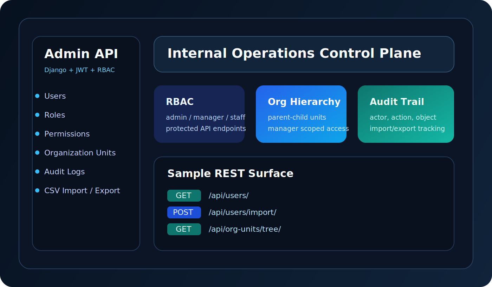

# django-rbac-admin-api

JWT-secured Django admin API for internal operations teams. The service models a compact but credible control plane: fixed RBAC roles, organization-aware user management, operational audit logs, CSV import/export, and a Dockerized PostgreSQL runtime.



## Feature list

- JWT login with refresh-token flow for API clients
- Fixed system roles: `admin`, `manager`, `staff`
- Protected user, role, permission, organization, and audit endpoints
- Organization hierarchy with parent-child units and manager ownership
- CSV import/export for users and organization units
- Django admin for browser-based operational access
- Docker Compose stack with PostgreSQL

## Stack

- Python 3.12
- Django 5
- Django REST Framework
- Simple JWT
- PostgreSQL
- Docker Compose

## Setup instructions

### Docker

```bash
copy .env.example .env
docker compose up --build
```

Open:

- `http://localhost:8010/` for the landing page
- `http://localhost:8010/admin/` for Django admin
- `http://localhost:8010/api/` for the browsable API
- `http://localhost:8010/health/ready/` for database readiness

Default admin credentials:

- Username: `admin`
- Password: `ChangeMe123!`

### Local

For a lightweight local run, copy `.env.example` to `.env`, switch `DB_ENGINE=sqlite`, then run:

```bash
python -m venv .venv
.venv\Scripts\activate
pip install -r requirements.txt
python manage.py makemigrations accounts organizations audits
python manage.py migrate
python manage.py shell -c "from config.bootstrap import ensure_system_roles, ensure_default_superuser; ensure_system_roles(); ensure_default_superuser()"
python manage.py runserver
```

### Demo data

For a stronger walkthrough, seed a small organization with manager and staff users:

```bash
python manage.py seed_demo_workspace
```

Demo workspace users use `ChangeMe123!` as the password and are intended for local portfolio review only.

### Tests

```bash
python manage.py test accounts.tests organizations.tests config.tests
```

For the full local verification flow used by CI:

```powershell
.\scripts\verify.ps1
```

The repository now includes automated RBAC and organization-scope tests plus a GitHub Actions workflow at `.github/workflows/ci.yml`.

## Sample API endpoints

- `POST /api/auth/token/` returns a JWT access/refresh pair
- `POST /api/auth/token/refresh/` refreshes an access token
- `GET /api/users/me/` returns the authenticated operator profile
- `GET /api/users/` lists users within the caller's permitted scope
- `GET /api/org-units/tree/` returns the organization hierarchy
- `GET /health/ready/` reports database readiness for Docker and deployment checks

See [docs/api-examples.md](docs/api-examples.md) for curl examples covering login, scoped users, CSV import/export, and the org tree.

## Example JWT login payload

```json
{
  "username": "admin",
  "password": "ChangeMe123!"
}
```

## Sample import shapes

```csv
username,email,first_name,last_name,title,org_unit_code,role_slugs
jane.ops,jane@example.com,Jane,Osman,Operations Lead,OPS,"manager"
amir.staff,amir@example.com,Amir,Rahimi,Support Specialist,OPS,"staff"
```

```csv
name,code,parent_code
Operations,OPS,
Customer Success,CS,OPS
```

## Case study

See [docs/case-study.md](docs/case-study.md) for the portfolio case study behind this project. It covers:

- the internal operations problem this system solves
- the access-control and org-scoping design decisions
- the auditability and import/export workflow choices
- the delivery outcome and why this type of API attracts startup clients

## Monitoring notes

See [docs/monitoring.md](docs/monitoring.md) for health endpoints, Docker health checks, and suggested production observability follow-up.

## Notes

- System roles are bootstrapped automatically on startup and can be updated, but not deleted or replaced with arbitrary slugs.
- Managers are scope-limited to users in their own organization unit; only admins can assign the `admin` role.
- The repository keeps migrations generated at runtime to keep the portfolio snapshot compact.
